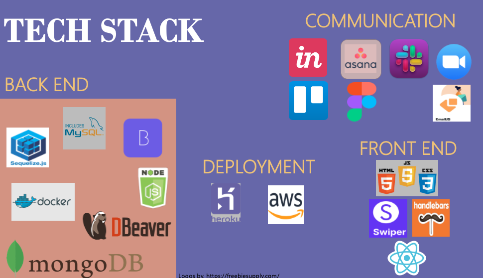

# Hi, I'm Jean! 

### Table of Contents
* [About Me](#about-me)<br>
* [Currently Working On](#currently-working-on)<br>
* [My Portfolio](#portfolio-of-projects)<br>
* [Author](#author)<br>
* [Acknowledgements](#acknowledgements)<br>

## About Me
An Agile, Full-Stack Software Engineer with extensive experience in commercial, healthcare and education industries.

```


💬 Recent winner of a 'Woman in Tech' Scholarship.

```


👩‍💻  Currently building and loving it!!

👯‍♀️  Scrum Master on two recent collaborative project. 

🤔  Looking for Projects where my transferable skills are valued and where I can add value.

🧠  Tech Stack includes Github, VScode, HTML, CSS, Javascript, Node, Docker, mySql and React.


<br>


## Currently Working On?
```
She's Building and Loving it!
```
⚡️ 

<br>
   

## Portfolio of Projects
 Please see a selection of my earlier work at the [Deployed Portfolio Website.](https://abrics.github.io/Abri-CS/)

  


## Author
- [@AbriCS](https://www.iteration50.io)
- [Get in Touch](mailto:devs@iteration50.io)

## Acknowledgements

 Inspiration, code snippets, etc.

- [awesome-readme](https://github.com/matiassingers/awesome-readme)
- [Trilogy Bootcamp Resources](https://www.trilogyed.com)
- [Online Tutorials](https://youtu.be/TQyOL1u10EI)


